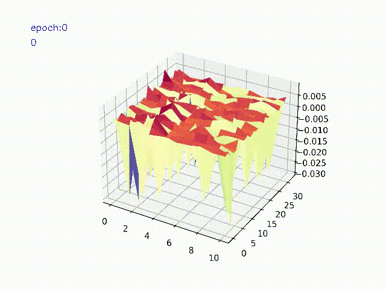
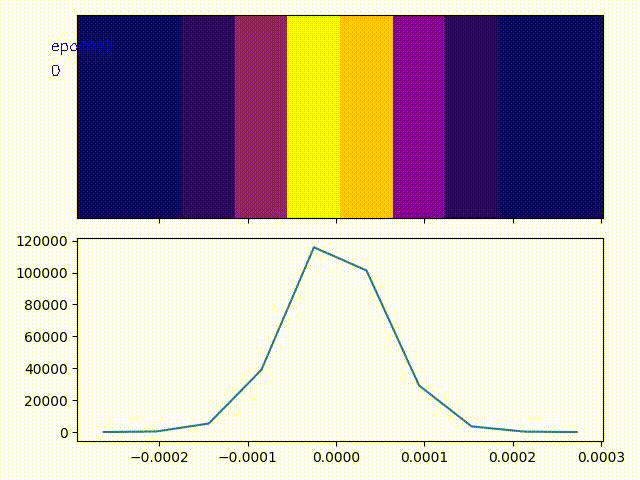
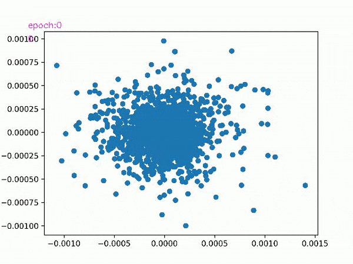

# What is pytorch_inspector
PyTorch library for inspecting the dynamics of a deep neural network model.
The library handles tensors by hooking forward/backward propagation and passes the tensors to separate processes for further analysis.  
The main goal of this library is to collect discrete information about the tensors of a model.

---

## Install pytorch_inspector

torch, torchvision, torch audio should be installed separately.

```console
pip3 install .
```

**Note**
The warning message *OpenBLAS Warning : Detect OpenMP Loop and this application may hang. Please rebuild the library with USE_OPENMP=1 option.* is shown if the tsne visualization is used. It may be necessary to install a version OpenBLAS with OpenMP support or recompile it. A possible solution is to install as follow:

```console
sudo apt-get install libopenblas-openmp-dev
```

### Uninstall 

```console
pip3 uninstall pytorch-inspector
```

### Status 

Testing the CI.  
Linux: [](https://github.com/Khoronus/pytorch-inspector/actions?query=workflow%3AStatus)

### Documentation

The documentation can be created offline with:

```
pip3 install pdoc
pdoc -t doc/custom_module pytorch_inspector --math -o doc # to output doc in doc/
open doc/pytorch_inspector.html
```

---

## How to use

The class is instantiated once and any invocation in the code refers to the first instance.

```python
# main.py
# ! pip install torchvision
import torch
from torchvision import models
from pytorch_inspector import ParrallelHandler, DataRecorder

def main():

    model = models.alexnet()

    #----------------------------------
    # Step 1: Define how to process the passed data
    #----------------------------------
    # Callback functions are used to process data passed from the main process to child processes.
    # DataRecorder is an example
    dr = DataRecorder(shape_expected=(640,480), fps=20., maxframes=20, path_root='output', colorBGR=(255,0,255), displayND_mode='default')

    #----------------------------------
    # Step 2: Define a ParrallelHandler
    #----------------------------------
    # A ParallelHandler manages all child processes.
    ph = ParrallelHandler(callback_onrun=dr.tensor_plot2D, callback_onclosing=dr.flush, frequency=20.0, timeout=30.0, target_method='spawn', daemon=True)

    #----------------------------------
    # Step 3: Attach layer/layers or full model
    #----------------------------------
    ph.track_model(-1, {'model': model}, callback_transform=None)
    ph.track_layer(-1, {'classifier0_': model.classifier[0], 'classifier3_': model.classifier[3], 'classifier6_': model.classifier[6]}, callback_transform=None)

    #----------------------------------
    # Step 4: Desired code ...
    #----------------------------------

    #----------------------------------
    # Step 5: Stop
    #----------------------------------
    ph = pytorch_inspector.ParrallelHandler()
    ph.stop(check_is_alive = True)
```

Furter calls in any part of the program can be done as follow:
```console
    ph = ParrallelHandler()
```

**Note**: If the multiprocess start mode is fork, please create the processes before initializing CUDA or an exception is raised.

**Additional Note**: A method to get all the valid handles is shown in **test/hook/test_automatic_hook.py** or in the examples.

The library has been tested on Python 3.10.9 with a Linux OS (Ubuntu 20.04).  

---
## Example 
Folder with examples about how to use the library.

---

## Test 
Folder with basic examples to test the correct behavior of the library.

---

## Output

The default data recorder will create a video of the tensors tracked. The current code creates plot for 2D tensors and 3D tensors in the form of [1xWxH]. Other shapes are converted in histograms (default) or 2D PCA is applied.  
<div style="text-align:center;">
  
  
  
</div>
 
---

## Design Notes

Tensors are passed to child process as it is. This may cause an increment in the VRAM usage. The default code test if there is enough memory to use the GPU tensor or pass to CPU.  

 The program will not check if the producer process will terminate. A warning message may be generated.  
```
[W CudaIPCTypes.cpp:15] Producer process has been terminated before all shared CUDA tensors released. See Note [Sharing CUDA tensors]
```

It may be advise to pass a callback_transform method to the **track** functions (i.e. *.cpu().clone().detach()*).  
Tensors passed to child process as CPU, clone, and detached will reduce the use of VRAM.  
It introduces some time delay, but it should be compensated by decreasing the frequency in which the data is pushed to queue.  

The library declares the following lines in pytorch_inspector/utils/DataPlot.py.  
```
matplotlib.use('Agg')
plt.ion()
plt.ioff()
```

### Hint
To run multiple processes on part of the same model: split the list of the layers.  
New process are created as daemon, and the program may close before a video is finalized. Please consider using daemon=False.  
```
    ph = ParrallelHandler(callback_onrun=dr.tensor_plot2D, callback_onclosing=dr.flush, frequency=20.0, timeout=30.0, target_method='spawn', daemon=True)
```

---
## Program Interruption

Interrupting the main process may create corrupted videos (please check cv2.WriteVideo for more information).  
It may also keep child process alive if created as spawn. Please set timeout greater than 0.

---
## Known Issues
1. Multi-device code may duplicate the hook handlers.  
Current default DataRecorder saves the result with the device ID information in the filename.    
In order to avoid multiple allocations, please consider to test the current device ID and disable the hook creation by setting *set_enabled=False*.  

In Lightning  
```python
from pytorch_lightning import Trainer
trainer = Trainer()
if trainer.global_rang == 0:
    ph.enabled = True
else:
    ph.enabled = False
```

In PyTorch
```python
if torch.cuda.current_device() == 0:
    ph.enabled = True
else:
    ph.enabled = False
```

2. PCA is slow for very larget tensors.  
The elaboration may take longer than expected if the tensor size is large (i.e. several seconds if size is [16, 16536, 1000]). Please, conside the use of the *displayND_mode='default'*.
